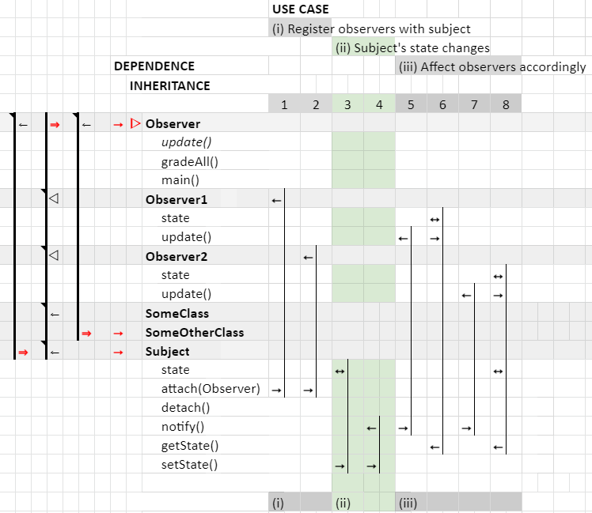
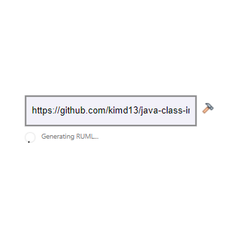

Generate Rectangular UML for Java Programs (work in progress)
============

Traditional UML diagrams become very cumbersome as codebases grow and are rarely used in practice because of this. Rectangular UML diagrams were created with scalability in mind and ease visualization in a compact fashion.

## Understanding

### Static Section (Left-hand Diagram)

ᐅ (RED): Object on the right is inherited by another object\
⇾ (RED): Object on the right is used by another object\

| (BLACK): Dependency channel\
⇒ (RED): Assignment of left-adjacent dependency channel to object on the right `this`\
⇽ (BLACK): Object on the right uses `this` object\
ᐊ (BLACK): Object on the right inherits from `this` object

### Dynamic Section (Right-hand Diagram)

*Object names are constructor calls

| (BLACK): Function trace\
⇾ (BLACK): Function on the left `this` is the entry point for the function trace on the right\
⇽ (BLACK): Function is called by `this`\
⇿ (BLACK): Variable is modified by `this`

## Usage

To facilitate the usage of GRUML, a new website is being built. The README me file will be updated once it is complete.

### Preview

